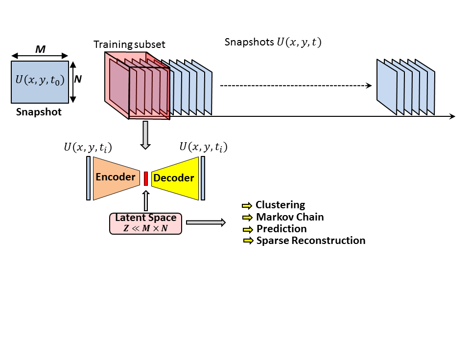
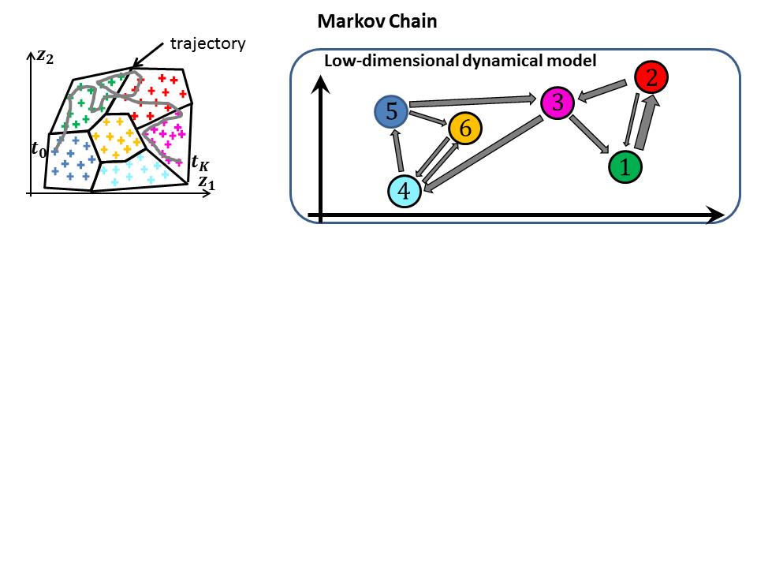
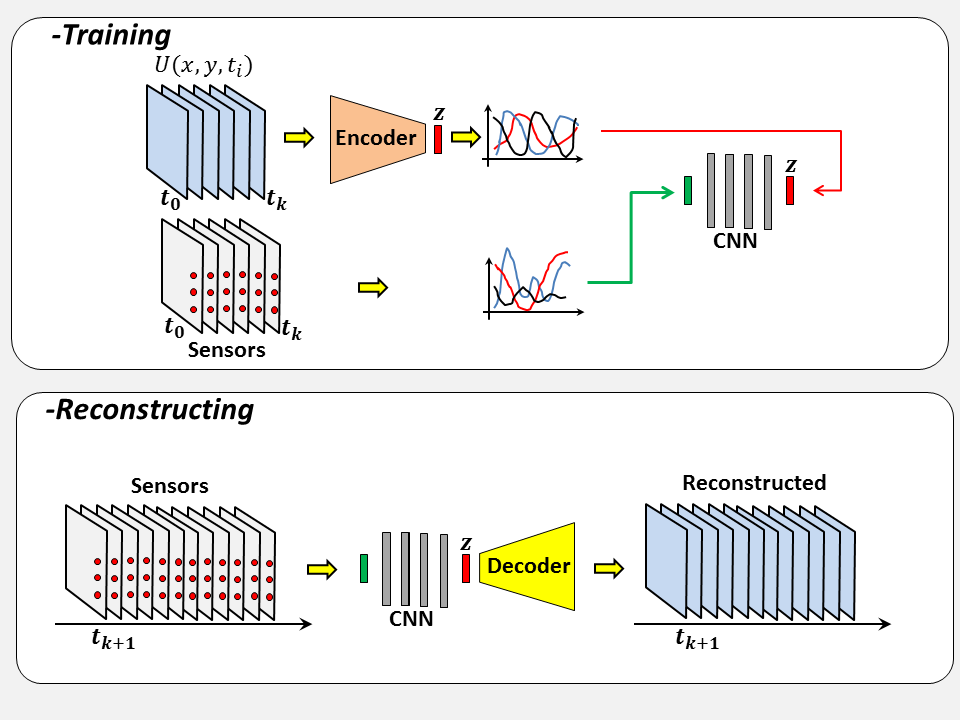

# Vortex_AE
How to exploit an Auto-encoder for exploring and predicting  flow dynamic
## Introduction
The dynamic associated to flow motion, it is in most case  highly-dimensional, strongly non-linear and populated by large spectre of spatio-temporal coherent structures. This complexity renders the study of fluid dynamic system extremely fascinating. As the field of fluid mechanics being in the enviable position of having the Navier-Stokes equations, one could assume that the flow motions can be perfectly predicted in principle through these equations (Laplace’s determinism). However, as N-S equations are also composed by no-linear terms, resolving these equations prove to be extremely complex and even impossible. For example for any viscous fluid in motion relative to a solid, as the fluid velocity decreases to zero at the wall, a shear layer is induced. this latter leads to the formation of chaotic turbulent structures within a wide spectrum of length and time scales; and the stronger the shear layer is, richer and more complex is the dynamics. 

## Autoencoder
In an autoencoder the encoder is separated from the decoder by a layer defined as latent space.  
The principle of the autoencoder is to learn how to reproduce the input. The size of the latent space define the purpose of the  autoencoder. In this work, the dimension of the latent space is massively reduced comparing to the input, the encoder's role is to compress the data, the encoded input is then converted it back to the original input shape by the decoder. By using  a latent space smaller than the input dimension,  the autoencoder has to learn and extract from the flow the most meaningful flow features, as only these informations can be used by the decoder to try to reconstruct the input. 

## First Step - Define and Train an Auto Encoder

## A - Clustering and Markov Chain (low-dimensional dynamic model)

## B - Sparse Reconstruction

## C - Prediction
The problem dimensionnality can be massively reduced by the Auto-Enoder. The v
Leveraging the temporal variation within the latent space, M.L algorimts cand be used for predicting the temporal dynamics of a low-order model of a turbulent flow

