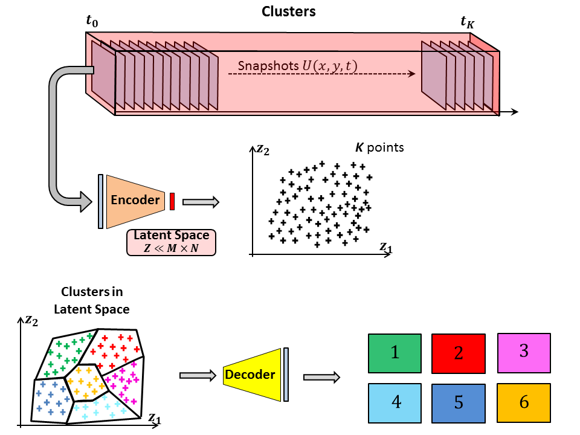

# Vortex_AE
How to exploit an Auto-encoder for exploring and predicting  flow dynamic

## First Step - Define and Train an Auto Encoder

## A - Clustering and Markov Chain (low-dimensional dynamic model)

## B - Sparse Reconstruction

## C - Prediction

