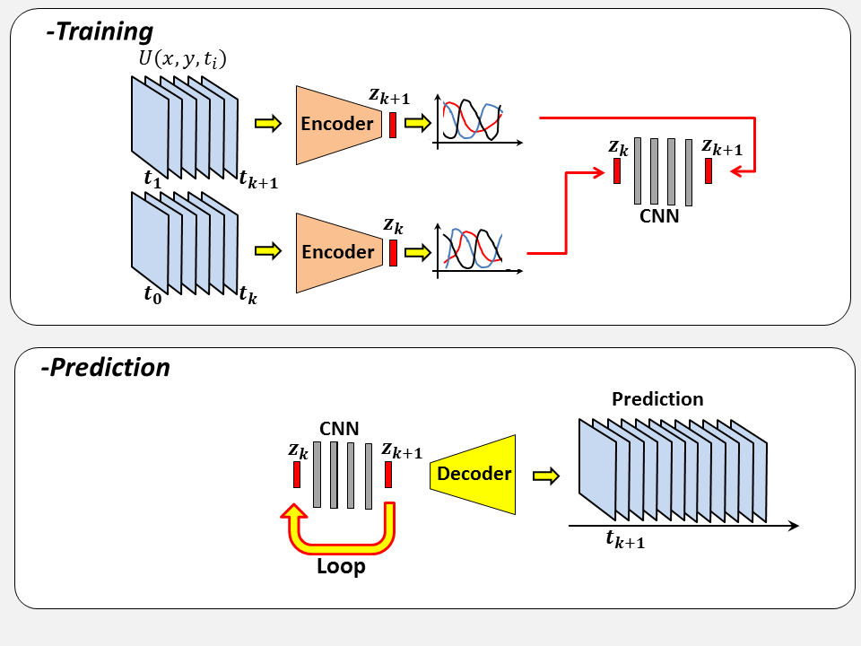

# Vortex_AE
How to exploit an Auto-encoder for exploring and predicting  flow dynamic

## First Step - Define and Train an Auto Encoder
## Clustering and Markov Chain (low-dimensional dynamic model)
## Sparse Reconstruction

## Prediction

